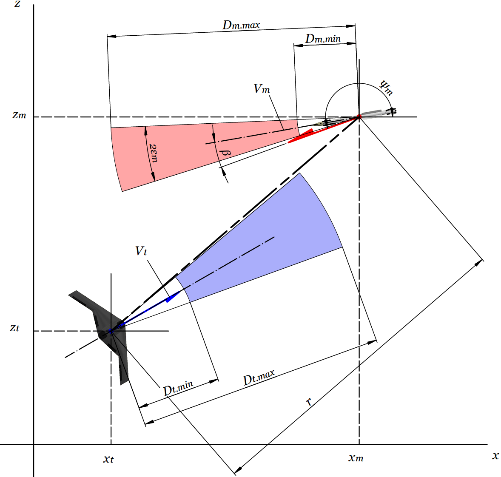
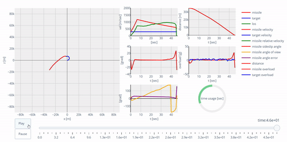
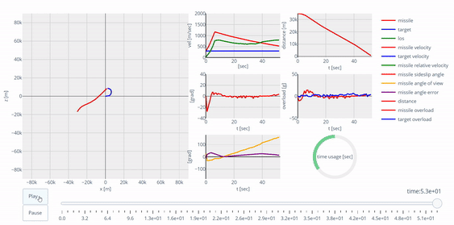

# "Умный" перехват

Задача заключается в обучении интеллектуального агента (ракеты) гарантированному
перехвату цели (скоростной маневренный беспилотник) на различных дальностях и
ракурсах пуска.

Достичжение результата предполагается за счет использования в методе наведения
ракеты алгоритмов машинного обучения.

К решению данной проблемы может хорошо подойти направление машинного обучения,
которое называется [Reinforcement Learning](https://habr.com/ru/articles/561746/).

Основным инструментом, используемым для реализации всех сущностей данного подхода,
был выбран фреймворк [Stable-Baselines3](https://stable-baselines3.readthedocs.io/en/master/).
Подходящим алгоритмом будет Soft Actor-Critic ([SAC](https://spinningup.openai.com/en/latest/algorithms/sac.html)),
т.к. он позволяет работать с непрерывным пространством действий и возможных состояний
системы.

## Математическая модель задачи

Движение оппонентов разворачивается в горизонтальной плоскости, т.е. высота
полета на протяжении перехвата постоянная. Математическая модель движения обоих
объектов представлена в виде динамики материальной точки
(для ракеты - переменной массы):

<p align="left">
  
</p>

## Как пользоваться

Подготовительные действия для работы в jupyter notebook:

```python
import os
import sys

module_path = os.path.abspath(os.path.join('..'))
sys.path.insert(0, module_path)
```

_Моделирование с агентом-целью и ракетой с пропорциональм сближением_

```python
import os
from src import Interception2D
from src.scenarios import make_escape_scenarios
from src.options import BASE_PATH 
from stable_baselines3 import SAC

scenarios, params = make_escape_scenarios(n=1, target_centered=True)
env = Interception2D(agent='target',scenarios=scenarios)
model = SAC.load(os.path.join(BASE_PATH, 'models', 'SAC-T_1'), env=env)
obs = env.reset()
done = False
while not done:
    action, _states = model.predict(obs)
    obs, rewards, done, _ = env.step(action)
env.post_render(tab=5, renderer='notebook')
```

_Моделирование с агентом-целью и агентом-ракетой (дуэль интеллектуальных агентов)_

```python
import os
from src import Interception2D
from src.scenarios import make_escape_scenarios
from src.options import BASE_PATH 
from stable_baselines3 import SAC

scenarios, params = make_escape_scenarios(n=1, target_centered=True)
# Создание окружения target_env, в котором будет принимать решения агент-цель
target_env = Interception2D(agent='target',scenarios=[])
target_model = SAC.load(os.path.join(BASE_PATH, 'models', 'SAC-T_1'), env=target_env)
# Создание окружения env, в котором будет принимать решения агент-ракета
env = Interception2D(agent='both', scenarios=scenarios, model=target_model)
missile_model = SAC.load(os.path.join(BASE_PATH, 'models', 'SAC-M_2'), env=env)

obs = env.reset()
done = False
while not done:
    action, _states = missile_model.predict(obs)
    obs, rewards, done, _ = env.step(action)
env.post_render(tab=8, renderer='notebook')
```

## Начальные условия

Оппонентам задается начальная скорость и положение друг относительно друга, а
также высота полета.

Начальные данные задаются в виде словаря или файла `values.yaml` со следующей
структурой:

```yaml
environment:
  altitude: 15000
  initial_distance: 20000
  initial_heading_error: 10
  initial_heading_angle: 45
  target_centered: False
  initial_psi: 90

missile:
  beta: 0
  alpha: 3
  vel: 300

target:
  acceleration_x: 0
  acceleration_z: 0
  vel: 300
```

Также, аналогичным образои должны быть заданы ограничения для окружения
(через словарь или файл `bounds.yaml`). Словарь/файл должен содержать
наборы ограничений для ракеты, цели и их окружения в целом.

Для ракеты это следующие величины:

* стартовая и пустая масса, кг;
* максимальный угол скольжения, град;
* максимальная и минимальная скорость в числах Маха;
* минимальная относительная скорость, необходимая для срабатывания взрывателя, м;
* максимальная возможная поперечная перегрузка;
* максимальный угол отклонения координатора головки самонаведения, град;
* дистанция захвата цели, м;
* дистанция срабатывания взрывателя, м.

Также должен быть задан параметр `beta_step_max`, который накладывает
ограничение на максимальный шаг по углу атаки за время одной итерации
интегрирования (`TAU` = 0.1 сек).

```yaml
missile:
  explosion_distance: &ref 15
  lock_on_distance: 20000
  overload_max: 50
  relative_velocity_min: 200
  mach_range: [ 0.8, 5.5 ]
  coordinator_angle_max: 40
  beta_max: 30
  beta_step_max: 1
  mass: [ 100, 165 ]
```

Для цели:

* максимальная возможная поперечная перегрузка;
* максимальная и минимальная скорость в числах Маха;
* дистанция захвата цели (может быть макисмальная и минимальная);
* максимальный угол отклонения координатора БРЛС;
* максимальный шаг по изменению поперечной перегрузки.

```yaml
target:
  overload_max: 8
  mach_range: [ 0.5, 2 ]
  detection_distance_range: [ 3000, 40000 ]
  coordinator_angle_max: 25
  acceleration_z_step_max: 10
```

Для окружения:

* максимальной время одного моделирования, сек;
* радиус зоны моделирования (при вылете одного из объектов за этот радиус
  моделирование прекращается);
* угол и радиус сектора, при преодолении которого считается, что цель покинула зону,
  которую необходимо защищать (т.е. цель проиграла).

Параметры, необходимые для нормализации вектора состояния окружения при обучении:

* область допустимых значений по скоростям;
* область допустимых значений по высотам (в процессе одного моделирования она
  постоянная, но во время обучения для различных сценариев может меняться);
* область допустимых значений по начальным дальностям.

```yaml
environment:
  termination_time: 150
  simulation_zone_radius: 90000
  mach_range: [ 0.5, 5.5 ]
  initial_distance_range: [ 500, 80000 ]
  altitude_range: [ 500, 20000 ]
  escape_sector_angle: 50
  escape_distance: 300000
```

Также, необходимо продублировать величину дальности срабатывания взрывателя
ракеты в набор `los`, т.к. линия визирования реализована отдельным объектом
со своей системой уравнений и параметрами состояния:

```yaml
los:
  distance_min: *ref
```

## Результаты моделирования

Моделирование перехвата по закону пропорционального сближения:

<p align="left">
  
</p>

Моделирование перехвата с использованием алгоритма SAC в контуре навеления ракеты:

<p align="left">
  
</p>
